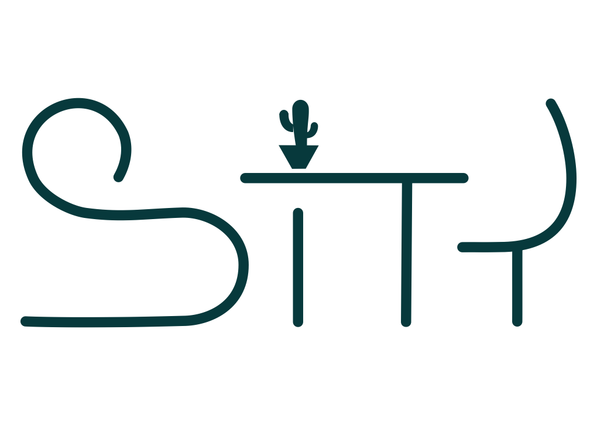

<!-- TABLE OF CONTENTS -->
<details>
  <summary>Table of Contents</summary>
  <ol>
    <li>
      <a href="#about-the-project">About The Project</a>
      <ul>
        <li><a href="#built-with">Built With</a></li>
      </ul>
    </li>
    <li>
      <a href="#getting-started">Getting Started</a>
      <ul>
        <li><a href="#prerequisites">Prerequisites</a></li>
        <li><a href="#installation">Installation</a></li>
      </ul>
    </li>
    <li><a href="#usage">Usage</a></li>
    <li><a href="#roadmap">Roadmap</a></li>
    <li><a href="#contributing">Contributing</a></li>
    <li><a href="#license">License</a></li>
    <li><a href="#contact">Contact</a></li>
    <li><a href="#acknowledgments">Acknowledgments</a></li>
  </ol>
</details>


> <!-- PROJECT LOGO -->
<br />
<div align="center">
  <a href="https://github.com/github_username/repo_name">
    
  </a>


<h3 align="center">SiTy</h3>

  <p align="center">
            In today's dynamic workplace, maximizing office space is essential.
            With our sensor-based technology, designed to track and display
            real-time table occupation data, SiTY improves workplace management,
            all while protecting user privacy. This solution not only ensures
            the efficient use of office facilities but also enhances convenience
            for all users. Its intuitive interface and real-time data enable
            employees to easily find available desks, reducing the stress of
            searching for or being stranded without a workplace. At the same
            time, no personal data is gathered, as SiTY only tracks whether a
            desk is occupied - but not by whome. Furthermore, through optimizing
            office space utilization, our solution contributes to a more
            sustainable workplace by reducing energy consumption and the need
            for additional real estate. SiTY empowers companies to adapt to the
            evolving demands of the modern office environment, fostering a
            productive, agile, and employee-friendly workspace that ensures that
            everybody finds their spot.
  </p>
</div>


### Built With

- [Python](https://www.python.org/)
- [Flask](https://flask.palletsprojects.com/en/3.0.x/quickstart/)
- [ReactJs](https://react.dev/)
- [TailWindCSS](https://tailwindcss.com/)
- [Firebase](https://firebase.google.com/)


<!-- CONTACT -->

### Contact

Gmail - sitymadlab@gmail.com

Project Link: [Gitlab](https://mad-srv.informatik.uni-erlangen.de/InnoLab/ws23_24/mad-office-solutions.git)

<!-- GETTING STARTED -->

## Getting Started

This is an example of how you may give instructions on setting up your project locally.

### Prerequisites

This is an example of how to list things you need to use the software and how to install them.

- npm
  ```sh
  npm install npm@latest -g
  ```

### Installation

1. Connect FAU CISCO AnyConnect Client
2. Clone the repo
   ```sh
   git clone https://mad-srv.informatik.uni-erlangen.de/InnoLab/ws23_24/mad-office-solutions.git
   ```
3. Install NPM packages
   ```sh
   npm install
   ```
4. Set up firebase Repository

5. Upload ESP_hardware code to the ESP's refering to README in ESP_hardware code and set up the sensor. 

5. Run Backend file refering to the backend README file
   ```sh
   python code/flask_backend/backend.py
   
   ```
6. Enter your API in `config.js`
   ```js
   const API_KEY = "ENTER YOUR API";
   ```
7. Run Frontend refering to the frontend README file
   ```js
   cd ./Code/React Frontend
   npm start 

<!-- USAGE EXAMPLES -->

## Project Structure

Give a brief overview of the project's structure by visualising the (sub-)folder structure and how files interact with each other.
```
MAD-OFFICE-SOLUTIONS
├── .gitlab //Main Repository
├── Code //All programming codes
│   ├── Backend_demo //Backend Code use for demo purpose
│   ├── db_simulation //Script for simulating sensor activity in database
│   ├── ESP_hardware_code //Hardware Code
│   ├── flask_backend //Backend Code
│   ├── LED_status  //Code for LED Status for Wooden Board 
│   ├── prototype15.11_streamlit //prototype code in .11_streamlit
│   └── React_Frontend // Frontend Code 
│       └── .gitkeep //Files should be in Git Repository
├── images //Images Repository
│   └── .gitignore //Files which should not be in Git Repository
├── LICENSE //Apache License
└── README.md
```

<!-- USAGE EXAMPLES -->

## Usage

Use this space to show useful examples of how a project can be used. Additional screenshots, code examples and demos work well in this space. You may also link to more resources.

_For more examples, please refer to the [Documentation](https://github.com/github_username/repo_name/-/wikis/)_

<!-- LICENSE -->

## License

Distributed under the Apache License. See `LICENSE.txt` for more information.

<!-- ACKNOWLEDGMENTS -->

## Acknowledgments

```

1- Digital Ocean digitalocean.com //For Hosting
2- Figma https://www.figma.com/ //For UI Designing
3- React Community https://react.dev/community //For Frontend programming
4. Flask https://flask.palletsprojects.com/en/3.0.x/ //For Backend programming
5. Firebase https://firebase.google.com/ //For Database

```
<p align="right">(<a href="#readme-top">back to top</a>)</p>
